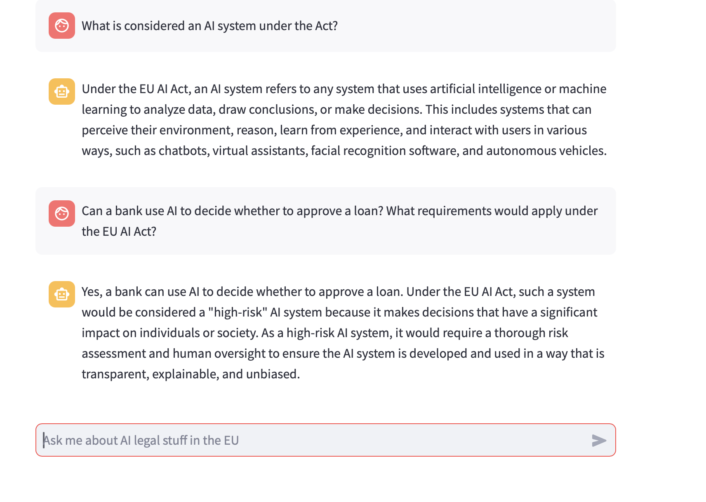
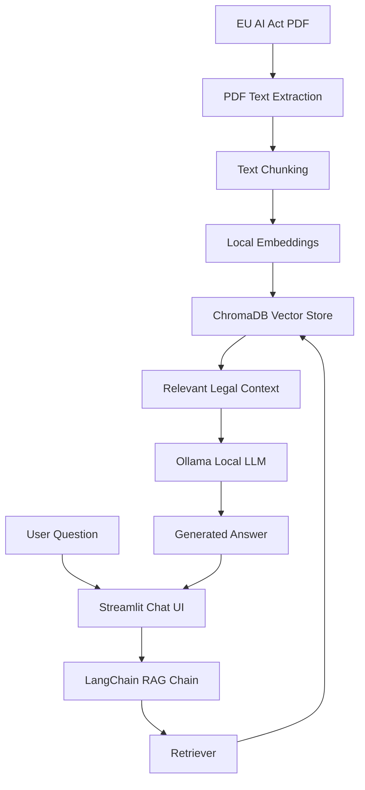

# Legal AI RAG Chatbot

A local Retrieval-Augmented Generation (RAG) chatbot that helps users ask questions about the European Union Artificial Intelligence Act. The chatbot retrieves relevant legal text from the EU AI Act and generates beginner-friendly answers using a locally running LLM through Ollama.

This project was built to demonstrate how legal documents can be made easier to understand using AI, vector search, document chunking, embeddings, and a conversational interface.

---

## Demo

### Chatbot Interface




---

## What PRojects does

The chatbot allows users to ask questions such as:

* What is the main objective of the EU AI Act?
* What are high-risk AI systems?
* Which AI practices are prohibited?
* Can a company use facial recognition cameras in public spaces?
* What obligations apply to providers of high-risk AI systems?

Instead of relying only on the LLM's general knowledge, the system retrieves relevant sections from the EU AI Act and uses them as context before generating an answer.

---

## Key Features

* Streamlit-based chat interface
* RAG pipeline using LangChain
* Local vector database using ChromaDB
* Local embeddings using Sentence Transformers
* Local LLM using Ollama
* No OpenAI API key required
* Conversation memory support
* EU AI Act used as the legal knowledge source

---

## Tech Stack

| Component       | Technology                      |
| --------------- | ------------------------------- |
| Frontend        | Streamlit                       |
| RAG Framework   | LangChain                       |
| Vector Database | ChromaDB                        |
| Embeddings      | Sentence Transformers           |
| LLM             | Ollama with Llama 3 / Llama 3.1 |
| PDF Processing  | PyMuPDF                         |
| Language        | Python                          |

---

## Architecture



---

## How the Project Works

### 1. PDF Loading

The project downloads the EU Artificial Intelligence Act PDF from the official EU Parliament URL.

### 2. Text Extraction

The PDF is processed using PyMuPDF, which extracts text from every page.

### 3. Text Chunking

The extracted text is split into smaller sections. This makes retrieval easier and allows the chatbot to find only the most relevant legal passages.

### 4. Embedding Generation

Each text chunk is converted into a numerical vector using a local Sentence Transformers embedding model.

### 5. Vector Storage

The embeddings are stored in ChromaDB, a local vector database.

### 6. Question Answering

When a user asks a question, the system:

1. Converts the question into a searchable form.
2. Retrieves relevant chunks from ChromaDB.
3. Sends the retrieved context to Ollama.
4. Generates a concise answer based on the legal document.

---

## Installation

### Prerequisites

Make sure you have:

* Python 3.11
* Git
* Ollama
* macOS/Linux/Windows terminal access

---

## Step 1: Clone the Repository

```bash
git clone https://github.com/sunandagandhi9/RAG-Legal-Assistant.git
cd RAG-Legal-Assistant
```

---

## Step 2: Create a Virtual Environment

```bash
python3.11 -m venv venv
source venv/bin/activate
```

For Windows:

```bash
python -m venv venv
venv\Scripts\activate
```

---

## Step 3: Install Dependencies

```bash
python -m pip install --upgrade pip
python -m pip install -r requirements.txt
```

If needed, install these manually:

```bash
python -m pip install streamlit chromadb langchain langchain-community langchain-ollama sentence-transformers pymupdf requests tqdm numpy
```

---

## Step 4: Install Ollama

On macOS:

```bash
brew install ollama
```

Start Ollama:

```bash
ollama serve
```

Open a new terminal tab and pull the model:

```bash
ollama pull llama3
```

If using Llama 3.1:

```bash
ollama pull llama3.1
```

Make sure the model name in `agent.py` matches the model you pulled.

Example:

```python
llm = ChatOllama(model="llama3")
```

or

```python
llm = ChatOllama(model="llama3.1")
```

---

## Step 5: Run the App

```bash
python -m streamlit run app.py
```

Then open the local URL shown in the terminal, usually:

```text
http://localhost:8501
```

---

## Example Questions

Try asking:

```text
What is the main objective of the EU AI Act?
```

```text
What are high-risk AI systems according to the EU AI Act?
```

```text
Which AI practices are prohibited under the EU AI Act?
```

```text
Can a company use facial recognition cameras in public places under the EU AI Act?
```

```text
What obligations do providers of high-risk AI systems have?
```

---

## Why This Project Is Useful

Legal documents are often long, technical, and difficult to understand. This project shows how RAG can make complex legal content more accessible by combining:

* document retrieval,
* vector search,
* local language models,
* and a simple chat interface.

It can be extended to other legal, policy, compliance, or regulatory documents.

---

## Future Improvements

* Add support for user-uploaded PDFs
* Show retrieved source chunks with answers
* Add page number citations
* Improve UI design
* Add Docker support
* Add evaluation questions and expected answers
* Support multiple legal documents
* Add authentication for private document use

---

## Disclaimer

This chatbot is for educational and demonstration purposes only. It does not provide legal advice. Users should consult qualified legal professionals for legal interpretation or decision-making.
